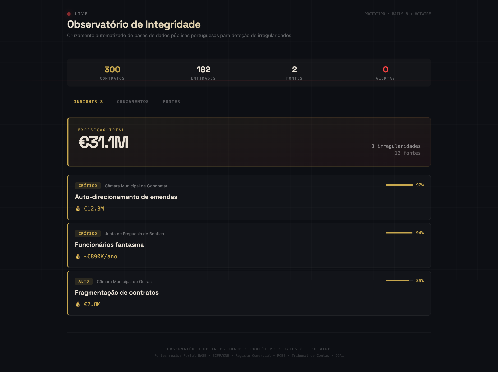
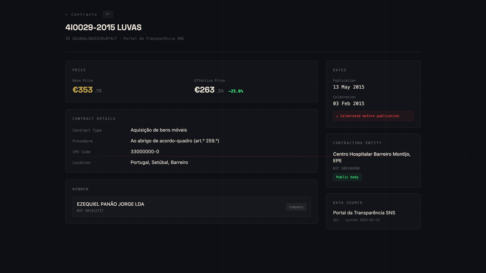

[🇵🇹 Versão em Português](README.pt.md)

# Integrity Observatory

A Rails 8 app that monitors public procurement data across multiple countries to flag corruption risk and abuse patterns. The output is cases for journalists and auditors to investigate, not conclusions.

## Overview

The app ingests procurement data from country-specific and EU-wide sources, then scores contracts against a red flag catalogue derived from OECD, OCP, and Tribunal de Contas methodology.


*Dashboard showing flagged contracts with risk scores*


*Contract detail page — "Celebrated before publication" flag fires when signing date precedes publication*

## International architecture

Each data source is a `DataSource` record with a `country_code` (ISO 3166-1 alpha-2), `adapter_class`, and JSON config. The domain model is scoped per country:

- `Entity` uniqueness is `[tax_identifier, country_code]` — the same NIF number in PT and ES belongs to different entities.
- `Contract` uniqueness is `[external_id, country_code]` — numeric IDs from different portals don't collide.
- `ImportService` resolves entities and contracts within the right country context.

Adding a new country requires an adapter class and a database record. No schema changes, no changes to existing code.

## Stack

- Ruby 3.3.0 / Rails 8
- SQLite + Solid Queue
- Hotwire + Tailwind CSS
- Minitest + SimpleCov (100% line coverage)

## Setup

```bash
bundle install
bin/rails db:create db:migrate
bin/dev
```

## Testing

```bash
bundle exec rails test
```

## Data sources

| Country | Source | What it provides | Adapter |
|---|---|---|---|
| PT | Portal BASE | Central public contracts portal (primary) | `PublicContracts::PT::PortalBaseClient` |
| PT | Portal da Transparência SNS | Health-sector contracts via OpenDataSoft | `PublicContracts::PT::SnsClient` |
| PT | dados.gov.pt | Open data portal, BASE mirrors and OCDS exports | `PublicContracts::PT::DadosGovClient` |
| PT | Registo Comercial | Company registrations, shareholders, management | `PublicContracts::PT::RegistoComercial` |
| PT | Entidade Transparência | Public entities, mandates, and persons | *(planned)* |
| EU | TED | EU procurement notices across all member states | `PublicContracts::EU::TedClient` |

Each `DataSource` record specifies a `country_code`, `adapter_class`, and JSON `config`. The adapter must implement `#fetch_contracts`, `#country_code`, and `#source_name`.

## Adding a new country

1. Create an adapter in `app/services/public_contracts/<iso2>/your_client.rb` inside the `PublicContracts::<ISO2>` namespace.
2. Implement `fetch_contracts`, `country_code`, and `source_name`.
3. Insert a `DataSource` record pointing to the adapter class.
4. Run `ImportService.new(data_source).call` to ingest.

## How scoring works

### Layer 1 — Procurement spine

Every contract is normalised to the same structure regardless of source country: authority, supplier NIF, procedure type, CPV code, prices, dates, amendment history.

### Layer 2 — External corroboration

The spine is joined against:
- TED, to check publication consistency for EU-threshold tenders
- AdC, to match supplier NIFs against Portuguese Competition Authority sanction cases
- Entidade Transparência, to link contract parties to persons in public roles
- Mais Transparência / Portugal2020, to prioritise EU-funded contracts

### Layer 3 — Two-track scoring

A single composite score is too easy to game and too hard to explain. Instead the system runs two tracks separately.

**Track A: rule-based flags.** Each flag has a fixed definition. If it fires, you know exactly why and can cite it in a referral or story:

| Flag | Signal |
|---|---|
| Repeat direct awards to same supplier | Same authority + same supplier, 3 or more direct awards within 36 months |
| Execution before publication | `celebration_date` earlier than `publication_date` in BASE |
| Amendment inflation | Amendment value > 20% of original contract price |
| Threshold splitting | Contract value within 5% below a procedural threshold |
| Abnormal direct award rate | Authority uses direct award far more than peers for the same CPV |
| Long execution | Contract duration > 3 years |
| Price-to-estimate anomaly | `total_effective_price` / `base_price` outside the expected range |

**Track B: pattern flags.** Statistical, for cases no single rule catches:

| Flag | Signal |
|---|---|
| Supplier concentration | One supplier takes a disproportionate share of a buyer's spend by CPV |
| Bid rotation | Suppliers who appear together but rarely actually compete |
| Pricing outlier | Contract price > 2σ from CPV × region × year distribution |
| Procedural shift | Spike in exceptional-procedure use near fiscal year end |

Each flagged case records which fields triggered it, a data completeness score, and a confidence level. Missing NIFs, impossible date sequences, and blank mandatory fields are themselves scored as flags — incomplete data often points at the same entities worth scrutinising.

See `AGENTS.md` for the full catalogue with OECD and OCP methodology references.

## How the data pipeline works

Each data source is a Ruby service class that handles the full ETL cycle:

1. **Extract** — fetch raw records from the source (REST API, file download, or web scrape)
2. **Transform** — convert the raw payload into a standard contract hash with consistent field names, date objects, and BigDecimal prices
3. **Load** — return the array; `ImportService` handles persistence and entity deduplication

All adapters live in [app/services/public_contracts/](app/services/public_contracts/) and must implement three methods: `fetch_contracts(page:, limit:)`, `country_code`, and `source_name`. The rest of the application never touches raw source data.

See `AGENTS.md` for the complete standard hash format, field-by-field documentation, and contributor checklist.

## Contributing

All pull requests are welcome. The project backlog lives on GitHub Issues, sorted by difficulty and priority so you can find something to work on quickly:

**[View open issues →](https://github.com/bit-of-a-shambles/observatory/issues)**

Issues are labelled by `difficulty: easy / medium / hard`, `type: data / flag / ui / infra`, and `priority: now / next / planned`. The `good first issue` label marks the most self-contained tasks.

### Automated testing — GitHub Actions

Every pull request is automatically tested by GitHub Actions. The workflow runs on every push and PR to `master`:

```
.github/workflows/ci.yml
```

It runs the full Minitest suite and enforces **100% line coverage** via SimpleCov. A PR cannot be merged if the coverage check fails. You do not need to run CI manually — push your branch, open a PR, and GitHub will run it for you.

To run the suite locally before pushing:

```bash
bundle exec rails test
```

SimpleCov prints line coverage at the end of the run. If it drops below 100%, add tests before opening a PR.

---

### For developers

#### Local setup

This is a Ruby on Rails 8 application. Requirements: Ruby 3.3.0, Bundler, SQLite.

```bash
git clone https://github.com/bit-of-a-shambles/observatory.git
cd observatory
bundle install
bin/rails db:create db:migrate db:seed
bin/dev          # starts Rails + Tailwind watcher
```

The app runs at http://localhost:3000. There is no Node.js or npm dependency — all JavaScript is served via importmaps.

#### Running data ingestors locally

Each data source has a service adapter that can be run from the Rails console or a runner script.

**Import from a specific source:**

```bash
# Portal BASE
bin/rails runner "DataSource.find_by(adapter_class: 'PublicContracts::PT::PortalBaseClient').tap { |ds| ImportService.new(ds).call }"

# SNS health contracts
bin/rails runner "DataSource.find_by(adapter_class: 'PublicContracts::PT::SnsClient').tap { |ds| ImportService.new(ds).call }"

# TED (EU notices for Portugal)
bin/rails runner "DataSource.find_by(adapter_class: 'PublicContracts::EU::TedClient').tap { |ds| ImportService.new(ds).call }"
```

**Import all active sources:**

```bash
bin/rails runner "DataSource.where(active: true).each { |ds| ImportService.new(ds).call }"
```

Or via the Rails console (`bin/rails console`) for interactive exploration.

The TED adapter requires a `TED_API_KEY` environment variable (free registration at developer.ted.europa.eu). All other sources require no API key.

#### Adding a new data source

1. Create `app/services/public_contracts/<iso2>/<source>_client.rb` inside the `PublicContracts::<ISO2>` namespace.
2. Implement `fetch_contracts(page:, limit:)`, `country_code`, and `source_name`.
3. `fetch_contracts` must return an array of standard contract hashes — format and all field definitions in `AGENTS.md`.
4. Stub all HTTP calls in tests. No live requests in the test suite. Coverage must reach 100%.
5. Add a `DataSource` fixture to `test/fixtures/data_sources.yml`.
6. Add a row to the data sources table in both README files and `AGENTS.md`.

#### Adding a red flag

1. Create a service in `app/services/flags/` that queries contracts and writes `Flag` records (`contract_id`, `flag_type`, `severity`, `details` JSON, `fired_at`).
2. Write tests covering at minimum: the flag fires on a matching contract, and does not fire on a non-matching one.
3. Add the flag to the Track A or Track B catalogue in `AGENTS.md`.

---

### For journalists and researchers

You do not need to write code to contribute:

- **Flag a contract** — if you spot something suspicious in the interface, open a GitHub issue with the contract URL and what caught your attention.
- **Suggest a data source** — if you know of a public procurement or integrity dataset not yet covered, open an issue with a link and a brief description.
- **Improve the red flag catalogue** — if you are familiar with OECD, TdC, MENAC, or OCP methodology and think an indicator is missing or miscalibrated, open an issue.
- **Test the data** — pick a sample of contracts and verify them against the original portal (Portal BASE, TED). Report discrepancies as issues.
- **Translate** — locale files are in `config/locales/`. A new language is a single YAML file. The README files will also need translating — open an issue to coordinate.

[Open an issue →](https://github.com/bit-of-a-shambles/observatory/issues/new)

## Roadmap

| Phase | Status | Scope |
|---|---|---|
| 1 — Procurement spine | In Progress | BASE ingestion, multi-country adapter framework, domain model, 100% test coverage |
| 2 — Rule-based dashboard | Next | Track A flags as DB queries, dashboard with severity filter and case drill-down |
| 3 — External enrichment | Planned | TED cross-checking, AdC sanction matching, Entidade Transparência layer |
| 4 — Pattern scoring | Planned | Track B statistical indicators: concentration index, pricing outliers, bid rotation |
| 5 — Case triage | Planned | Confidence scoring, evidence trail per case, export for TdC / AdC / MENAC referral |
| 6 — Ownership layer | Constrained | RCBE beneficial ownership linkage — access is limited |


## Docs

- `AGENTS.md` — domain model, data sources, indicator catalogue, ETL pattern, coding standards
- `DESIGN.md` — UI/UX design system
- `docs/plans/` — implementation plans and research blueprints
- [GitHub Issues](https://github.com/bit-of-a-shambles/observatory/issues) — canonical backlog
